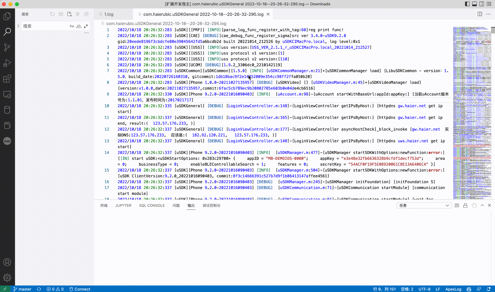
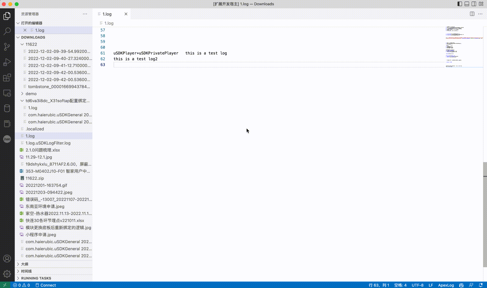

# usdklogfilter README

uSDK日志过滤, 基于vscode-extension-filter-line插件进行改造

## Usage

打开命令模式 (⇧⌘P)，输入 `uSDKLogFilter`，选择相应命令进行日志过滤

### uSDKLogFilter By Version

### uSDKLogFilter By Device

### uSDKLogFilter By Trace

### uSDKLogFilter By SoftAp

1. 包含`uSDKBinding, uSDKSoftApBinding, uSDKSoftApConfig, uSDKNetworkReachabilityManager, cloud_get_device_bind_result, uSDKHttpsHALInterface, getBindResult`
2. 暂未包含用户侧绑定、在线绑等日志，待具体需求后补充

### uSDKLogFilter By Video

### uSDKLogFilter By BLE

1. 包含`uSDKBinding, uSDKBLEBinding, uSDKWiFiBLEBinding, uSDKNetworkReachabilityManager, getBindResult`
2. 可查询V5设备Wi-Fi&BLE配网日志
3. 暂未包含V2设备，无网先绑等相关日志，待具体需求后补充

**Enjoy!**
